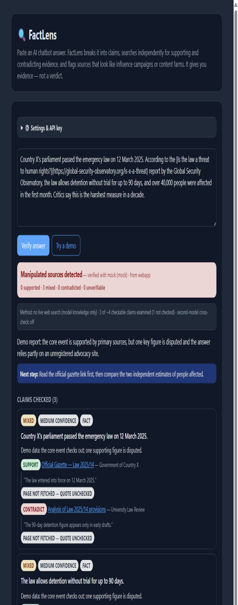

<div align="center">

# 🔍 FactLens

**Stress-test AI chatbot answers instead of trusting them.**

Independent evidence search · claim-by-claim verdicts · manipulation-pattern source profiling

[](https://github.com/YOUR_USERNAME/factlens/actions/workflows/ci.yml)
[](LICENSE)


</div>

---

Chatbots that read the web can be gamed. Influence campaigns publish reports with
**question-shaped headlines** so AI chatbots quote them as neutral research. A documented
example (The Guardian, Aug 2026): a fake "US think tank", set up and funded by Israel,
published 500,000+ words of question-titled reports designed to be the first thing
ChatGPT and Google AI cite on Gaza. Researchers call this technique
**Generative Engine Optimization (GEO)** — SEO, but for AI answers.

FactLens fights back by doing what the chatbot should have done:

> **FactLens never outputs "true" or "lie."** It produces evidence, verdict-per-claim with
> links, and source warnings — the final judgment stays with the reader. Any tool claiming
> to output "the truth" would itself become a single point of manipulation.

## How it works

```
 AI answer (+ cited links)
        │
        ▼
 ① CLAIM SPLIT      break the answer into separate checkable claims
        │
        ▼
 ② EVIDENCE HUNT    per claim: independent search for sources that
        │           SUPPORT and CONTRADICT it — never reusing the
        │           answer's own sources (Gemini search grounding)
        ▼
 ③ SOURCE PROFILER  every source gets:
        │           • code heuristics: question-shaped headlines (GEO),
        │             no named author, unregistered "think tank",
        │             sponsored content, raw AI-generated text
        │           • AI publisher profile: funding, stance, credibility
        ▼
 ④ BIAS ANALYSIS    framing issues, missing context, strongest argument
        │           AGAINST the answer
        ▼
 ⑤ REPORT           trust signal (computed in code, not by the model),
                    per-claim verdicts, source warnings, Markdown export
```

The headline verdicts are **computed by code** from the check results — a gamed or
biased model cannot award itself a friendly rating.

## What a report looks like



The report shows: the trust banner **with the counts behind it**, a transparency
line stating exactly what the verification did (live search? how many of the
checkable claims? quotes verified?), per-claim verdicts with evidence links and
**quote verification chips** ("quote verified on page" vs "quote NOT found on
page"), source warning flags, the bias & framing analysis, and an optional
**second-model opinion** that is asked to challenge the first review.

## Features

- 🔎 **Verify anywhere** — one click under AI answers on ChatGPT, Gemini, Claude and
  Perplexity; right-click on any selected text; or paste into the side panel / web app.
- 🧾 **Quote verification** — evidence quotes are checked against the fetched page
  text; "not found" is flagged instead of silently trusted.
- 🧭 **Second-model cross-check** — optionally send the checked claims to a second,
  different AI provider and let it challenge the first review; disagreements are
  shown in the report. (Mitigates single-model bias — the checker itself.)
- 🌍 **Multilingual heuristics** — GEO headline detection and think-tank naming
  patterns in English **and Arabic** (هل/ماذا/لماذا…, معهد/مرصد/مؤسسة), sponsored
  content markers in both.
- ⚖️ **Cross-partisan by design** — the established-publisher list spans wire services,
  courts/UN bodies, academics, and newspapers from different editorial lines, with
  documented inclusion criteria ([SOURCE-LISTS.md](docs/SOURCE-LISTS.md)).
- 🛡️ **Prompt-injection hardened** — fetched pages and analyzed answers are treated as
  untrusted data in every model prompt ([threat model](docs/THREAT-MODEL.md)).
- 🚫 **Zero dependencies, zero telemetry, no build step** — plain ES modules.
- 🔁 **Resilient** — automatic retry with backoff on rate limits (user cancellation
  is never retried); a failed step degrades the report, it never crashes it.
- 💾 **Cached & cancellable** — identical answers render instantly from cache
  (with a "re-run fresh" escape), and long runs can be cancelled mid-flight.
- 🌗 **Light & dark** — follows your system theme.
- 🌍 **English & Arabic UI** — RTL layout included; language follows the system or
  is set manually. Model-generated report text stays in the language the
  verification was performed in.

## Install (Chrome / Edge / Brave)

1. Clone or download this repository.
2. Open `chrome://extensions` → enable **Developer mode** → **Load unpacked** →
   select the `extension/` folder.
3. Click the FactLens icon → paste a **free Gemini API key**
   ([aistudio.google.com/apikey](https://aistudio.google.com/apikey)) → **Save** →
   **Test connection**.
4. No key yet? Click **"Try a demo"** for a full sample report (canned data).

OpenRouter and OpenAI-compatible endpoints also work, but free models there cannot
search the web, so evidence quality is lower.

## Usage

- **On ChatGPT, Gemini, Claude, or Perplexity:** a blue "🔍 FactLens — verify this answer"
  button appears under each AI response. Click it and the report opens in the side panel.
- **Anywhere on the web:** select the text → right-click → **"FactLens: verify selected text"**
  — the side panel opens automatically and runs.
- **Manual:** open the side panel and paste any answer. Links in the pasted text
  (markdown or bare URLs) are picked up as sources automatically.
- Results for identical answers + settings are cached; press **Verify** again for a
  fresh run, or **Cancel** mid-run to abort. Every report can be copied to the
  clipboard or exported as Markdown.

## Development

```bash
node test/smoke.mjs                        # 73-check offline suite — no key, no network
python scripts/generate_icons.py           # regenerate extension icons (pure stdlib)
python scripts/dev-server.py               # serve webapp/panel at localhost:8123 for manual testing
FACTLENS_GEMINI_KEY=… node scripts/live-check.mjs   # one REAL end-to-end run (costs ~5 free-tier calls)
```

The offline suite covers the whole pipeline with a mock provider; `live-check.mjs`
is the companion for a real API pass — it runs a small answer with two checkable
claims through Gemini with Google Search grounding, prints the report with quote
statuses, and applies sanity gates (grounding used, evidence returned, not all
unverifiable). The key is read from the environment only and never stored.

There is nothing to build: load `extension/` unpacked and edit the files.
See [CONTRIBUTING.md](CONTRIBUTING.md) for the ground rules (evidence-not-verdicts,
code-computed trust signal, tested heuristics, cross-partisanship).

## Repository layout

```
extension/          Manifest V3 extension (no build step)
  engine/           Shared verification engine (also used by the web app)
    providers/      gemini · openrouter · openai-compat · mock
    steps/          claims · evidence · bias · summary
    ui/             storage · settings · report renderer · cache (shared with webapp)
  content/          chatbot answer detection + Verify buttons
  panel/  popup/    side panel & settings UI
webapp/             paste-text web app reusing the same engine
docs/               ARCHITECTURE.md · THREAT-MODEL.md · SOURCE-LISTS.md
scripts/            icon generator · dev server
test/smoke.mjs      offline pipeline test suite
```

## Roadmap

- [ ] Domain-age / Wayback-first-seen checks for source profiling
- [ ] UI translations (Arabic first)
- [ ] Firefox port (Manifest V2/V3 differences)
- [ ] Credibility notes from Wikipedia/Wayback instead of model memory
- [ ] Optional local-model provider (e.g. via Ollama)

## Known limitations

- Free-tier daily limits on Gemini's search-grounded requests.
- Some sites block fetching; those sources are profiled from link text + model
  knowledge only (marked in the report). Quote chips then read
  "page not fetched — quote unchecked".
- Quote verification matches the quote against the extracted page text; a
  "not found" flag can also mean the quote sits behind JavaScript or a paywall.
- The verification model is itself an AI with blind spots — every claim in a report
  carries links so readers can check the primary evidence. The optional second-model
  cross-check reduces, but does not remove, this risk.

## Privacy

API keys and settings never leave your device (browser-local storage). Text is sent
only to the AI provider you configure; fetches use `credentials: "omit"`.

## Governance

- [Contributing](CONTRIBUTING.md) — ground rules and how to add heuristics/providers
- [Code of Conduct](CODE_OF_CONDUCT.md)
- [Security policy](SECURITY.md) — prompt injection, key handling, evasion reports
- [Threat model](docs/THREAT-MODEL.md) — what FactLens defends against, and what it doesn't
- [Verification log](docs/VERIFICATION.md) — what is tested, how, and what remains
- [Changelog](CHANGELOG.md)

## License

[MIT](LICENSE) © FactLens contributors

## Acknowledgements

- The Guardian, ["Fake US thinktank set up and funded by Israel sought to influence AI chatbots"](https://www.theguardian.com/world/2026/aug/26/fake-thinktank-israel-ai-propaganda)
- Politico, ["Israeli PR wants to answer your ChatGPT questions"](https://www.politico.com/newsletters/politico-influence/2026/08/14/israeli-pr-wants-to-answer-your-chatgpt-questions-01038138)
- GEO manipulation research: [arXiv 2311.09735](https://arxiv.org/pdf/2311.09735)
