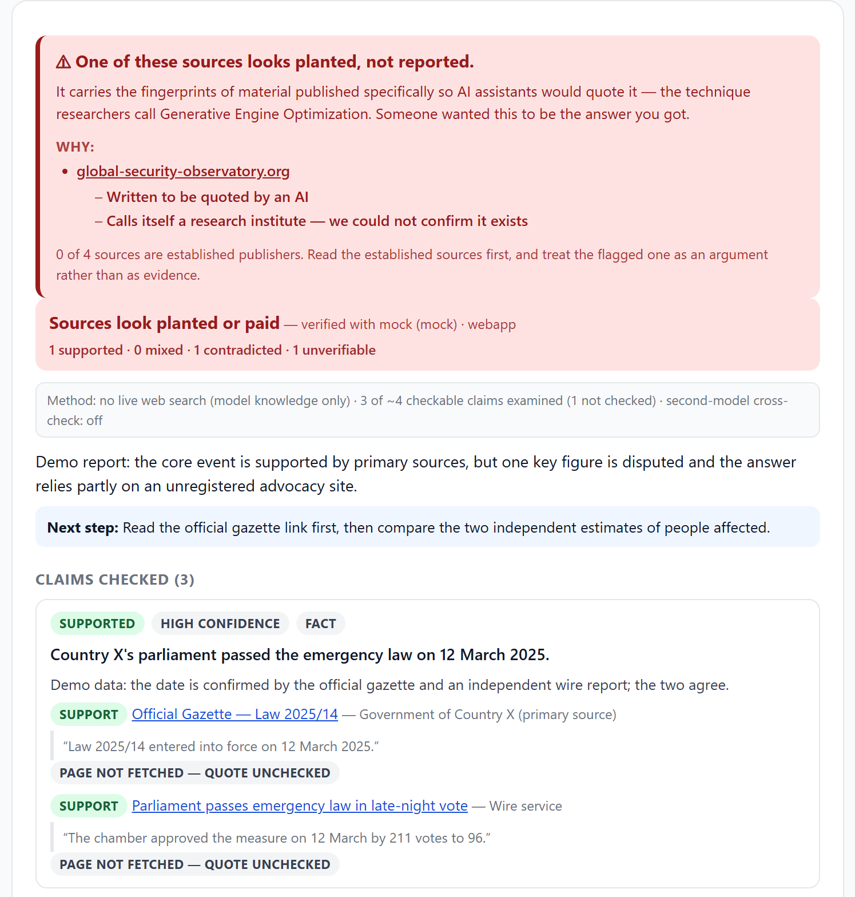
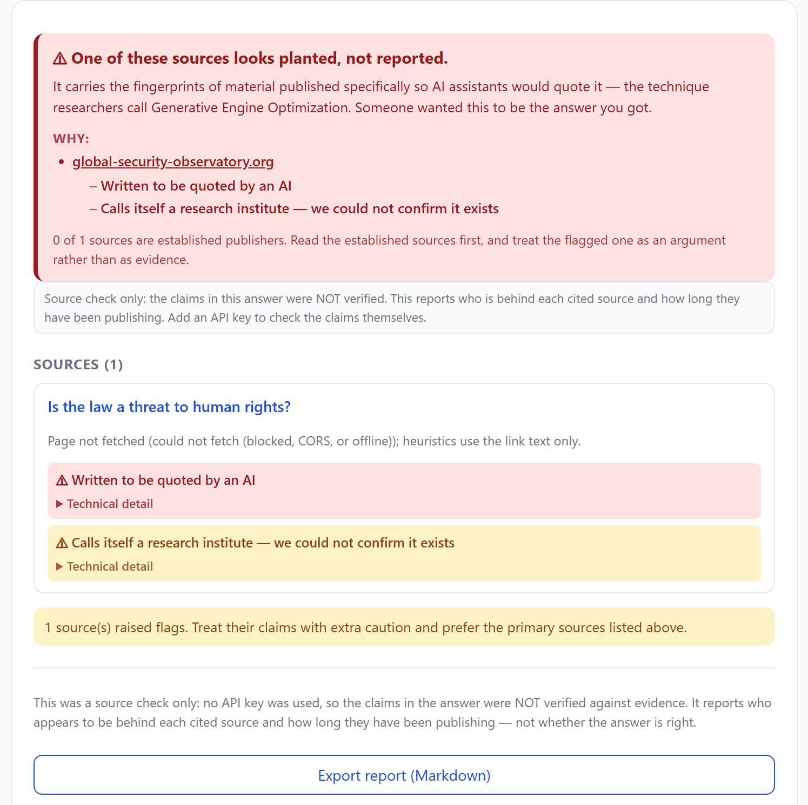
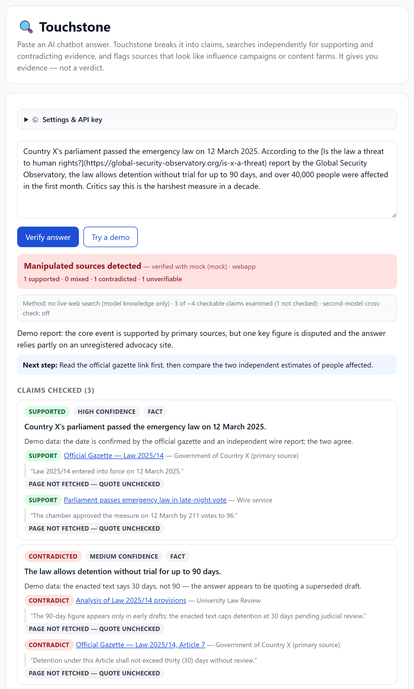
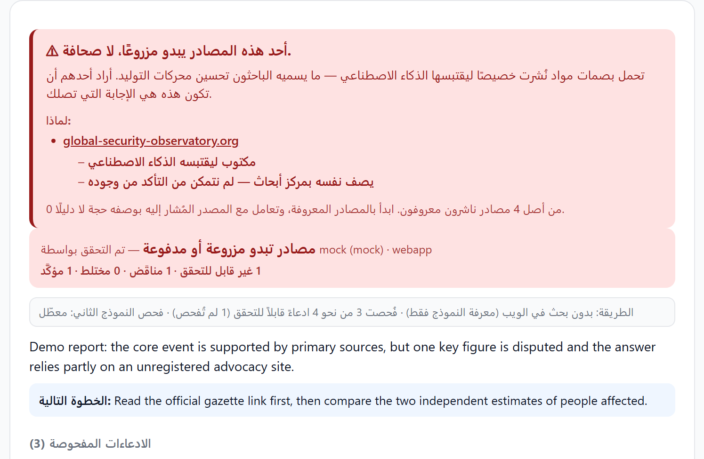

<div align="center">


# Facts Only

**Find out who paid to be in your AI answer.**

Independent evidence search · claim-by-claim verdicts · manipulation-pattern source profiling

[](https://github.com/MohammadThabetHassan/facts-only/actions/workflows/ci.yml)
[](LICENSE)


</div>

---

When you ask a chatbot a question, you assume the answer came from whatever the
evidence says. Increasingly it did not: it came from whoever spent the most money
making sure the chatbot would find their version first.

The technique has a name — **Generative Engine Optimization (GEO)**, SEO for AI
answers. You publish material with **question-shaped headlines** that match the way
people prompt chatbots, so the model quotes you instead of the reporting. A documented
example (The Guardian, Aug 2026): a fake "US think tank", set up and funded by Israel,
published 500,000+ words of question-titled reports engineered to be the first thing
ChatGPT and Google AI cite on Gaza. The chatbot then repeats it as neutral research,
because nothing in the answer tells you it was placed there.

Facts Only puts that missing label back. It takes the answer apart, goes and finds
evidence for itself, and — first, before any of the technical detail — tells you in one
sentence whether someone appears to have paid or planted their way into what you just
read, and which source it was.

> **What "Facts Only" means here.** It is not a promise to hand you the truth — a tool
> that claimed that would become the single point of manipulation worth attacking. It
> means stripping out what is there because it was *bought*: paid placement, planted
> "research", publishers who will not say who funds them. What survives is closer to
> fact. Facts Only never outputs "true" or "false"; it shows you the evidence, the
> counter-evidence, and who is behind each source, and you decide.

## Does it actually work?

Heuristics that flag sources are easy to write and easy to believe. These are
measured instead, on every commit, against two failure modes — because a tool
like this drifts into the second one by default, and that is the one that lands
on a real newsroom.

| | result | the rule this replaced |
| --- | --- | --- |
| Legitimate publishers accused of placement (held-out half) | **0 / 40 (0%)** | 40 / 40 (100%) |
| Adversary rungs detected (below the stated ceiling) | **8 / 8 (100%)** | 1 / 8 (12.5%) |

The weights were hand-set against this corpus, so the headline is measured on a
**held-out half** the tuning never touched — 79 publishers, split by a stable hash
of the domain so the split cannot drift toward whatever flatters the result.
Across the whole corpus it is also 0 accused of 209, and the tuning half scores
the same, so there is no overfitting gap. The tuning number stays printed beside
it so a future gap is visible.

Those rows use constructed page bodies, so the detector is also run over **70
real article pages fetched from these outlets** (`eval/collect-pages.mjs`):
**0 of 70 accused**, one cautioned, and article extraction found the article in
68 of 70 pages it was never tuned against. 139 outlets could not be read at all
— 133 expose no usable feed, 6 refused — which is reported rather than trimmed,
because being refused is the condition the tool meets most often.

The 209 publishers carry **real Wayback histories** and are chosen to be hostile
to this tool's known weaknesses: weighted toward the press no allowlist covers
(South Asian, African, Middle Eastern, Latin American, South-East Asian,
independent investigative), plus **22 real research institutions whose names trip
the "self-described think tank" heuristic on purpose** — RAND, Pew, SIPRI,
Chatham House, Bruegel, the Lowy Institute. **195 of the 209 are not on any list
inside this repo**; they score clean because a long, continuously archived
publishing record is itself evidence of an ordinary publisher. Each one is scored
as though it had published the exact headline shape the detector hunts for, which
is harder than reality.

The adversary is a campaign site plus each cheap change a real operator would
make. The old rule lost at **rung 1: deleting one question mark.** Rung 6 is
buying an *aged but barely archived* domain — the standard answer to a naive age
check — and it is caught, because age was never the signal; continuous archived
publishing is.

**Continuous archived publishing can, however, be bought.** Lapsed domains that
already carry decades of real history are traded routinely, and the archive
record transfers with them. The same crude campaign that scores 100 on a fresh
domain scores 40 on an 18-year expired one, and clean once it adds a byline and
an about page. This is the most serious gap in the model, because the archive
signal carries most of its discriminating power. It is scored and printed under
**Documented misses** rather than left for a reader to find.

Paid content is **decisive**: an advertorial is flagged even on a thirty-year-old
masthead, because a trusted name makes a placement more effective, not less. That
rule exists because the harness caught the opposite behaviour shipping. Every
weight is also perturbed ±20% and the measurement re-run, so the numbers are a
real operating point rather than a fit to this corpus.

**The ceiling is stated, not hidden.** An operation that runs a real site for six
years is not distinguishable from a publisher by these signals, is not detected,
and is excluded from the numerator rather than buried in a friendlier
denominator. The honest claim: *this raises the cost of placement from one
character to a six-year operation.*

```bash
npm run eval     # reproduce all of it offline, no key, no network
```

Method, corpus criteria, and the full ladder: **[docs/EVALUATION.md](docs/EVALUATION.md)**.

## What a report looks like

<div align="center">
  
</div>

**The plain-language warning comes first, on purpose.** Most people will read that box
and nothing else, so it has to answer the only question that matters — *is someone paying
to be in this answer, and which source is it?* — in a sentence, with the site named and
linked. Its wording is ranked worst-first, so paid content is never softened into
"an unnamed publisher". Like the trust signal, it is computed in code from the source
flags, so the model being checked cannot tone it down.

Below it, for readers who want the mechanism: the trust banner **with the counts behind
it**, a transparency line stating exactly what the verification did (live search? how many
of the checkable claims? quotes verified?), per-claim verdicts with evidence links and
**quote-verification chips** ("quote verified on page" vs "quote NOT found on page"),
per-source warnings — each in plain words, with the technical heuristic one click away —
the bias and framing analysis, and an optional **second-model opinion** asked to challenge
the first review.

<details>
<summary>The keyless source check, the full web app, and the Arabic RTL layout</summary>

**No API key.** The same warning, from page metadata and archive history alone,
with the report stating plainly that the claims were not verified:

<div align="center">
  
  <br><br>
  
  <br><br>
  
</div>

Screenshots are generated, not hand-cropped: `python scripts/capture-screenshots.py`.

</details>

## How it works

```
 AI answer (+ cited links)
        │
        ▼
 ① CLAIM SPLIT      break the answer into separate checkable claims
        │
        ▼
 ② EVIDENCE HUNT    per claim: independent search for sources that
        │           SUPPORT and CONTRADICT it — never reusing the
        │           answer's own sources (Gemini search grounding)
        ▼
 ③ SOURCE PROFILER  every source gets:
        │           • code heuristics: question-shaped headlines (GEO),
        │             no named author, unregistered "think tank",
        │             sponsored content, raw AI-generated text,
        │             domain first archived <90 days ago
        │           • AI publisher profile: funding, stance, credibility
        ▼
 ④ BIAS ANALYSIS    framing issues, missing context, strongest argument
        │           AGAINST the answer
        ▼
 ⑤ REPORT           trust signal (computed in code, not by the model),
                    per-claim verdicts, source warnings, Markdown export
```

The headline verdict is **computed by code** from the check results — a gamed or biased
model cannot award itself a friendly rating. The decision order and thresholds are part of
a documented contract ([ARCHITECTURE.md](docs/ARCHITECTURE.md)) and are covered by tests.

## Features

- 🔓 **Works with no API key at all** — "Check sources only" runs the half of
  the pipeline that never needed a model: who is behind each cited source, how
  long they have really been publishing, and the same plain-language warning.
  No signup, no cost, no setup. The report states plainly that the claims
  themselves were not verified.
- 💰 **Says who paid, in plain words** — the report opens with one sentence a
  non-technical reader understands ("One of these sources looks planted, not reported"),
  names the site, and lists why. Ranked worst-first so paid placement outranks every
  softer signal, and computed in code so it cannot be talked down.
- 🔎 **Verify anywhere** — one click under AI answers on ChatGPT, Gemini, Claude and
  Perplexity; right-click on any selected text; or paste into the side panel or web app.
- 🧾 **Quote verification** — evidence quotes are checked against the fetched page text;
  "not found" is flagged instead of silently trusted.
- 🧭 **Second-model cross-check** — optionally send the checked claims to a second,
  different provider and let it challenge the first review; disagreements are shown in the
  report. This mitigates single-model bias, including in the checker itself.
- 🏛️ **Domain-age detection** — every non-established source domain is checked against the
  Wayback Machine (keyless): domains first archived under 90 days ago, or never archived
  at all, are flagged as influence-campaign signals.
- 🌍 **Multilingual heuristics** — GEO headline detection and think-tank naming patterns in
  English **and Arabic** (هل/ماذا/لماذا…, معهد/مرصد/مؤسسة), sponsored-content markers in both.
- ⚖️ **Cross-partisan by design** — the established-publisher list spans wire services,
  courts and UN bodies, academic venues, and newspapers from different editorial lines,
  with documented inclusion criteria ([SOURCE-LISTS.md](docs/SOURCE-LISTS.md)).
- 🔇 **Silence is never an all-clear** — a source that could not be fetched and
  has no archive record is reported as *"we could not check who is behind this"*,
  never as clean. A failed check that reads like reassurance is the most harmful
  thing this tool could say.
- 🛡️ **Hardened against the attack it studies** — fetched pages and analyzed answers are
  treated as untrusted data in every model prompt, and model-supplied URLs are refused
  unless they are public web addresses, so a page cannot steer the extension into the
  user's own network ([threat model](docs/THREAT-MODEL.md)).
- 🧮 **Auto-free OpenRouter models** — set the model to `auto-free` and the provider
  discovers currently-available free models, ranks them for fact-checking, and falls back
  down the list on failures or rate limits.
- 🚫 **Zero dependencies, zero telemetry, no build step** — plain ES modules.
- 🔁 **Resilient** — automatic retry with backoff on rate limits (user cancellation is
  never retried); a failed step degrades the report, it never crashes it.
- 💾 **Cached and cancellable** — identical answers render instantly from cache (with a
  "re-run fresh" escape), and long runs can be cancelled mid-flight.
- 🌗 **Light and dark**, following the system theme.
- 🌍 **English and Arabic UI**, RTL layout included.

## Install

Prebuilt packages are attached to every
[release](https://github.com/MohammadThabetHassan/facts-only/releases), alongside a
CycloneDX SBOM and `SHA256SUMS`.

The archives are **reproducible** — sorted entries, fixed timestamps — so you do not have
to take the checksums on trust. Rebuild from the tag and compare:

```bash
npm run release && sha256sum dist/*.zip
```

**Chrome / Edge / Brave**

1. Download `facts-only-extension-vX.Y.Z.zip` from the latest release and unzip it
   (or clone this repository and use the `extension/` folder directly).
2. Open `chrome://extensions` → enable **Developer mode** → **Load unpacked** → select the
   unzipped folder.

**Firefox 128+**

1. Download `facts-only-firefox-vX.Y.Z.zip` and unzip it, or build it yourself with
   `npm run build:firefox`.
2. Open `about:debugging` → **Load Temporary Add-on…** → select the `manifest.json`
   inside it. This is a temporary install; see the roadmap for signed builds.

The Firefox package is not a repackaged Chrome build: `scripts/build-firefox.py` rewrites
the manifest for Gecko — event page instead of a service worker, `sidebar_action` instead
of `side_panel` — while the engine, panel and content scripts are shared verbatim.

### What the SBOM says

`sbom.cdx.json` is committed and checked in CI, so it cannot drift from the code. Its most
useful claim is a negative one: **zero runtime dependencies**. Nothing third-party executes
on your machine, and the file is the evidence rather than the assertion — the dev toolchain
(TypeScript, ESLint) is listed separately with CycloneDX scope `excluded`. It also carries a
SHA-256 per shipped file, so a downloaded package can be verified file by file, not just as
one opaque archive hash.

**Then, in either browser**

3. Click the Facts Only icon → paste a free Gemini API key
   ([aistudio.google.com/apikey](https://aistudio.google.com/apikey)) → **Save** →
   **Test connection**.
4. No key yet? Click **Try a demo** for a full sample report built from canned data.

OpenRouter and OpenAI-compatible endpoints also work, but free models there cannot search
the web, so evidence quality is lower.

## Usage

- **On ChatGPT, Gemini, Claude, or Perplexity:** a blue "🔍 Facts Only — verify this
  answer" button appears under each AI response. Click it and the report opens in the side
  panel.
- **Anywhere on the web:** select the text → right-click → **Facts Only: verify selected
  text**. The side panel opens automatically and runs.
- **Manual:** open the side panel and paste any answer. Links in the pasted text (markdown
  or bare URLs) are picked up as sources automatically.
- Results are cached per answer and settings; press **Verify** again for a fresh run, or
  **Cancel** mid-run to abort. Every report can be copied to the clipboard or exported as
  Markdown.

The web app also takes URL parameters: `?demo=1` runs the sample report on load, and
`?lang=ar` renders it in Arabic.

## Development

There is no build step and there are no dependencies — load `extension/` unpacked and edit
the files.

```bash
npm test                  # 147-check offline suite: no key, no network
npm run test:e2e          # 15 real-browser checks in headless Chrome
npm run eval              # measure the detector against 50 real publishers
npm run typecheck         # type-check the engine from its JSDoc (still no build step)
npm run lint              # dev-only lint: undefined refs, dead code, swallowed errors
npm run dev               # serve webapp + panel at localhost:8123
npm run build:firefox     # build the Firefox add-on directory
npm run package           # store-ready zip of the Chrome extension
```

All six run in CI on every push, and the eval thresholds are build gates:
loosening one is a visible, argued commit.

Each script is a plain `node` or `python` invocation if you would rather not use npm — see
`package.json`.

For a real end-to-end pass against the live API:

```bash
FACTS_ONLY_GEMINI_KEY=... node scripts/live-check.mjs
```

That runs one small answer with two checkable claims through Gemini with Google Search
grounding, prints the report with quote statuses, and applies sanity gates (grounding was
used, evidence was returned, not everything came back unverifiable). It costs roughly five
free-tier calls. The key is read from the environment only and is never stored.

See [CONTRIBUTING.md](CONTRIBUTING.md) for the ground rules: evidence not verdicts, a
code-computed trust signal, tested heuristics, and cross-partisanship.

## Repository layout

```
extension/          Manifest V3 extension (no build step)
  engine/           Shared verification engine (also used by the web app)
    providers/      gemini · openrouter · openai-compat · mock
    steps/          claims · evidence · bias · summary
    sourceScore.js  weighted placement scoring (the model, tuned against eval/)
    sourceCheck.js  keyless source-only check — no API key needed
    explain.js      plain-language risk summary (computed in code)
    ui/             storage · settings · report renderer · cache (shared with webapp)
  content/          chatbot answer detection + Verify buttons
  panel/  popup/    side panel & settings UI
webapp/             paste-text web app reusing the same engine
docs/               ARCHITECTURE · EVALUATION · THREAT-MODEL · SOURCE-LISTS · VERIFICATION
eval/               accuracy measurement: corpus, collector, CI gate
scripts/            icon generator · dev server · packaging · screenshot capture
test/smoke.mjs      offline pipeline test suite
```

## Roadmap

- [x] Domain-age / Wayback-first-seen checks for source profiling
- [x] UI translations (Arabic first)
- [x] Firefox port
- [ ] Signed Firefox add-on and a Chrome Web Store listing
- [ ] Credibility notes from Wikipedia and Wayback instead of model memory
- [ ] Optional local-model provider (e.g. via Ollama)
- [x] Narrow `<all_urls>` to an optional permission requested on first fetch
- [x] Measured accuracy with a false-positive corpus and an adversary ladder
- [ ] Grow the adversary ladder as new placement techniques are published
- [ ] Publisher-registry and funding lookups, to push past the six-year ceiling

## Known limitations

- **The detector has documented ceilings, and one of them is cheap.** An
  external review changed a campaign headline from *"How the law threatens
  human rights"* to *"The law threatens human rights"* and the score fell from
  29/elevated to 15/clean. That is one word, not the six years of publishing
  history the ladder's top rung describes. Headline shape is deliberately weak
  evidence, because a detector that fired on plain declarative headlines would
  flag ordinary journalism — but the practical consequence is that headline
  signals are one edit from useless. Both ceilings are scored and printed by
  `npm run eval` under **Documented misses**.
- **A verdict is only as good as the evidence behind it, and now says so.** The
  same review showed the pipeline returning "Well supported" for claims the
  model asserted with an empty evidence list. Verdicts are now gated: a claim
  with no usable evidence counts as *unverifiable*, never as supported, and
  evidence drawn only from the answer's own citations is not counted as
  independent.
- The keyless source check is strongest in the extension, which holds host
  permissions. In the web app CORS blocks page fetches and the archive lookup,
  so most sources come back as "could not check" rather than cleared.
- Free-tier daily limits apply to Gemini's search-grounded requests.
- Some sites block fetching; those sources are profiled from link text and model knowledge
  only, and marked as such. Quote chips then read "page not fetched — quote unchecked".
- Quote verification matches the quote against the extracted page text, so a "not found"
  flag can also mean the quote sits behind JavaScript or a paywall.
- Model-generated report text (summaries, publisher profiles) stays in the language the
  verification ran in; only the UI chrome is translated.
- The verification model is itself an AI with blind spots. Every claim in a report carries
  links so readers can check the primary evidence, and the optional second-model
  cross-check reduces — but does not remove — this risk.

## Privacy

API keys and settings never leave your device (browser-local storage). Text is sent only
to the AI provider you configure. Page fetches use `credentials: "omit"`, and the API key
travels in a request header rather than a URL, so it stays out of browser history and
proxy logs.

## Governance

- [Contributing](CONTRIBUTING.md) — ground rules, and how to add heuristics or providers
- [Code of Conduct](CODE_OF_CONDUCT.md)
- [Privacy policy](docs/PRIVACY.md) - what leaves your device, and where it goes
- [Store listing pack](store/LISTING.md) - everything a store submission asks for
- [Security policy](SECURITY.md) — prompt injection, key handling, evasion reports
- [Evaluation](docs/EVALUATION.md) — how accuracy is measured, and where it fails
- [Threat model](docs/THREAT-MODEL.md) — what Facts Only defends against, and what it does not
- [Verification log](docs/VERIFICATION.md) — what is tested, how, and what remains
- [Changelog](CHANGELOG.md)

## License

[MIT](LICENSE) © 2026 Mohammad Thabet Hassan

## Acknowledgements

- The Guardian, ["Fake US thinktank set up and funded by Israel sought to influence AI chatbots"](https://www.theguardian.com/world/2026/aug/26/fake-thinktank-israel-ai-propaganda)
- Politico, ["Israeli PR wants to answer your ChatGPT questions"](https://www.politico.com/newsletters/politico-influence/2026/08/14/israeli-pr-wants-to-answer-your-chatgpt-questions-01038138)
- GEO manipulation research: [arXiv 2311.09735](https://arxiv.org/pdf/2311.09735)
